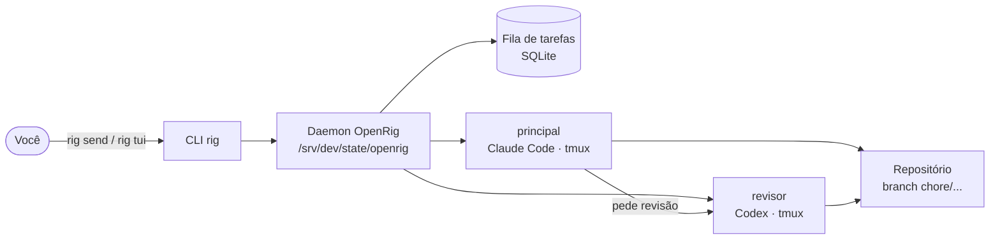
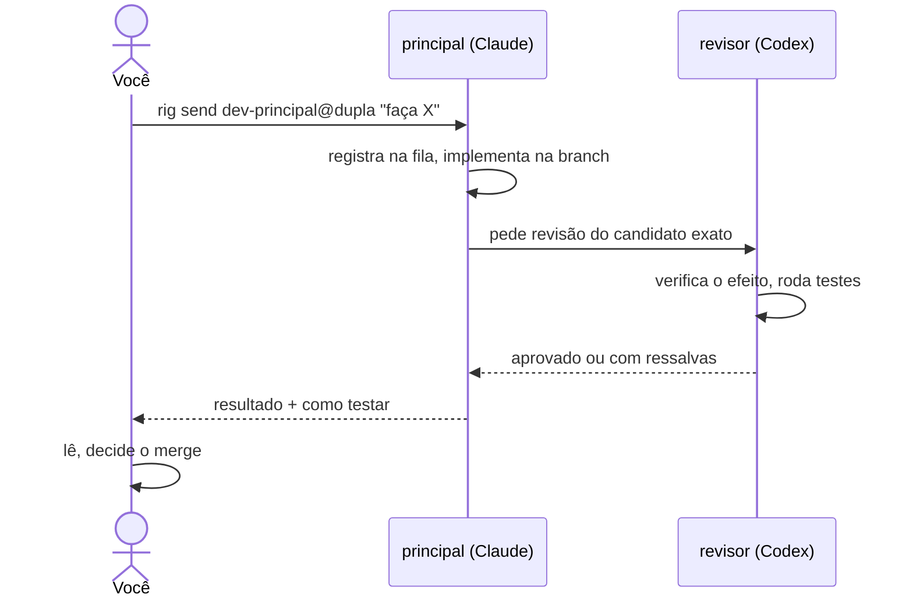
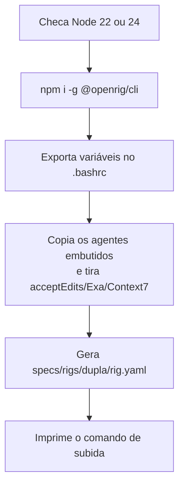

# OpenRig na VPS

O OpenRig faz o Claude Code e o Codex trabalharem como uma equipe só: cada agente numa
sessão tmux, com endereço fixo, fila de tarefas e um daemon que acompanha tudo.
Aqui a equipe se chama `dupla`: **principal** (Claude) implementa, **revisor** (Codex) confere.

## Peças



- **CLI `rig`**: o que você digita.
- **Daemon**: guarda estado, fila e quem está vivo. Sobe sozinho no primeiro `rig up`.
- **Seats**: cada agente é um "assento" com endereço `dev-principal@dupla` e `dev-revisor@dupla`.

## Uma tarefa, do pedido ao resultado



O merge é sempre seu. Pelo `CLAUDE.md`, o revisor nunca faz merge e ninguém faz push em `main`.

## O que o `14-openrig.sh` faz



Ele não sobe a equipe. Só instala e prepara.

## Ligado e desligado

| Item | Estado | Por quê |
|---|---|---|
| Estado em `/srv/dev/state/openrig` | ligado | junto do resto que os agentes escrevem |
| Kernel (agentes extras do OpenRig) | **desligado** | subiria agentes com a config padrão |
| Hooks do Codex | **desligado** | não reescreve o `~/.codex/config.toml` do `04` |
| MCP Exa/Context7 | **desligado** | fora da curadoria do `04` |
| Hook de atividade do Claude | ligado | alimenta o painel |
| Claude com `acceptEdits`, Codex com `workspace-write` | ligado | postura mínima do OpenRig, não dá para tirar |

Efeito colateral: o painel mostra a atividade do principal, mas não a do revisor.

## Uso

```sh
cd /srv/dev/repos/<arvore>/<projeto>
git switch -c chore/<tarefa>
rig up /srv/dev/state/openrig/specs/rigs/dupla/rig.yaml --cwd . --plan   # confere
rig up /srv/dev/state/openrig/specs/rigs/dupla/rig.yaml --cwd .          # sobe
rig tui --shared                                                          # acompanha
rig send dev-principal@dupla 'Implemente X, peça revisão ao revisor e me diga como testar.'
```

`Ctrl-b d` sai do painel sem derrubar nada. `rig ps --nodes --rig dupla` mostra se os dois estão prontos.
