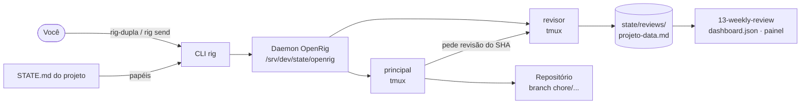
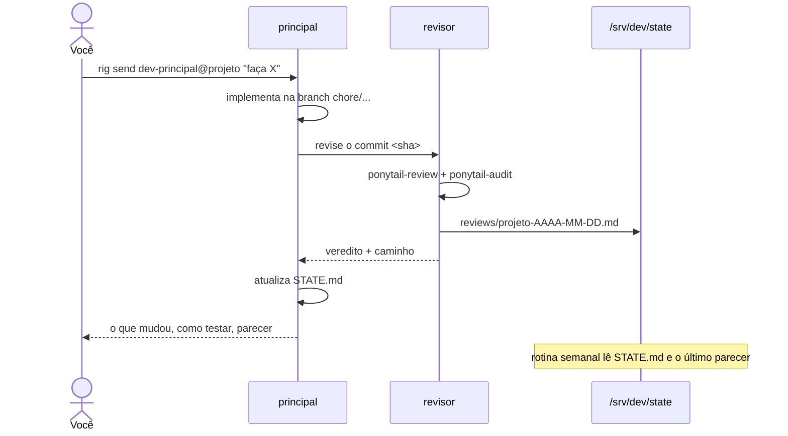
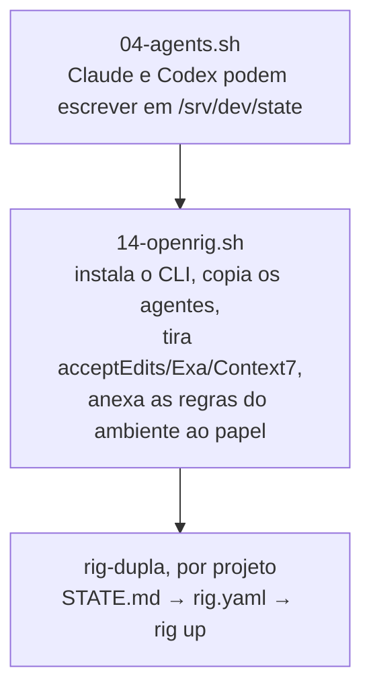

# OpenRig na VPS

O OpenRig faz dois agentes trabalharem como equipe num projeto: cada um numa sessão tmux,
com endereço fixo e fila de tarefas. Aqui ele só **executa o processo que já existe**
(`CLAUDE.md` §3): quem é principal e quem é revisor vem do `STATE.md`, o parecer vai para
`/srv/dev/state/reviews` e o painel semanal lê de lá.

## Peças



- **`rig-dupla`**: lê o `STATE.md`, monta o rig do projeto e sobe. Recusa `main`/`master` e papel `A DEFINIR`.
- **Daemon**: guarda estado e fila. Sobe sozinho no primeiro `rig up`.
- **Seats**: `dev-principal@<projeto>` e `dev-revisor@<projeto>` (ponto no nome vira hífen: `n.pentest` → `n-pentest`).

## Uma tarefa, do pedido ao painel



O merge é sempre seu. Ninguém faz push em `main`.

## O que cada script faz



As regras anexadas ficam em `openrig/principal.md` e `openrig/revisor.md`. Editar lá e rodar o `14` de novo.

## Ligado e desligado

| Item | Estado | Por quê |
|---|---|---|
| Papéis pelo `STATE.md` | ligado | uma fonte só, a mesma do painel |
| Escrita em `/srv/dev/state` | ligado | onde o revisor grava o parecer |
| Kernel (agentes extras do OpenRig) | **desligado** | subiria agentes com a config padrão |
| Hooks do Codex | **desligado** | não reescreve o `~/.codex/config.toml` do `04` |
| MCP Exa/Context7 | **desligado** | fora da curadoria do `04` |
| Claude com `acceptEdits`, Codex com `workspace-write` | ligado | postura mínima do OpenRig |

Efeito colateral: o painel do OpenRig não mostra a atividade de seat em Codex.

## Uso

```sh
cd /srv/dev/repos/<arvore>/<projeto>
git switch -c chore/<tarefa>
rig-dupla --plan        # confere papéis e plano
rig-dupla               # sobe
rig tui --shared        # acompanha; Ctrl-b d sai sem derrubar
rig send dev-principal@<projeto> 'Implemente X, peça revisão e me diga como testar.'
```
